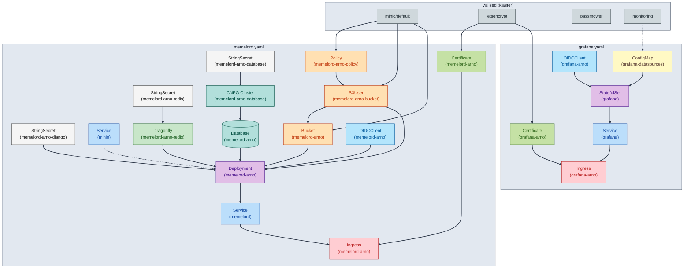

# memelord-arno

MemeLord (Django) + Grafana Helm chart. Mitu instantsi võimalik ({{ .Release.Name }}, values-*.yaml).

| Rakendus | URL |
|----------|-----|
| MemeLord | https://memelord-arno.ee-lte-1.codemowers.io |
| Grafana | https://grafana-arno.ee-lte-1.codemowers.io |

## Repo failid

| Fail | Kirjeldus |
|------|-----------|
| `Chart.yaml`, `values.yaml`, `values-memelord-arno.yaml`, `values-memelord-arno2.yaml` | Helm chart ja values |
| `templates/memelord.yaml`, `templates/grafana.yaml`, `templates/monitoring.yaml` | Templatiseeritud manifestid |
| `grafana-promote-user.sh` | Helper: tõsta OIDC kasutaja Grafana Admin’iks (SQLite DB muudatus) |

**Välised sõltuvused (klaster):** `minio/default`, `letsencrypt` ClusterIssuer, `passmower` (OIDC), `monitoring` namespace (Prometheus, Loki).

## Elementide sõltuvused (Mermaid)



## Deploy (Helm)

```bash
kubectl create namespace memelord-arno

# MemeLord
kubectl create configmap settings --from-file=settings.py=./settings.py -n memelord-arno --dry-run=client -o yaml | kubectl apply -f -
helm upgrade --install memelord-arno . -n memelord-arno -f values-memelord-arno.yaml
```

**Grafana kasutaja Admin’iks:** `./grafana-promote-user.sh memelord-arno arno.kender@gmail.com`

## ArgoCD

- **ArgoCD** jookseb **ee-west-1** klustris; **rakendused** deploy’itakse **ee-lte-1** klustrisse.
- **Repo:** https://github.com/alfakilo87/memelord-arno  
- **UI:** https://argocd.ee-west-1.codemowers.io/applications  
- **memelord-arno:** `argocd-application-memelord-arno.yaml` | **memelord-arno2:** `argocd-application-memelord-arno2.yaml`
