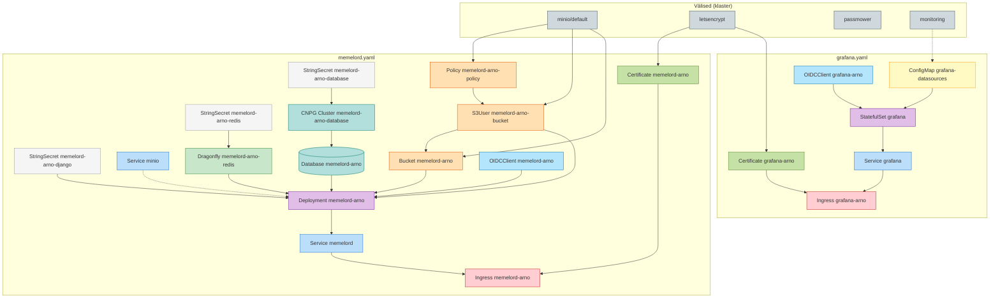

# memelord-arno

MemeLord (Django) ja Grafana deployment Kubernetesile – namespace `memelord-arno`.

| Rakendus | URL |
|----------|-----|
| MemeLord | https://memelord-arno.ee-lte-1.codemowers.io |
| Grafana | https://grafana-arno.ee-lte-1.codemowers.io |

## Repo failid

| Fail | Kirjeldus |
|------|-----------|
| `memelord.yaml` | MemeLord: StringSecrets (redis, django, database), Service minio (ExternalName), Dragonfly, CNPG Cluster/Database, S3 Policy/S3User/Bucket, Deployment, Service memelord, Certificate, Ingress, OIDCClient |
| `grafana.yaml` | Grafana: ConfigMap (datasources Prometheus/Loki), StatefulSet (sqlite PVC), Service, Certificate, Ingress, OIDCClient |
| `grafana-promote-user.sh` | Helper: tõsta OIDC kasutaja Grafana Admin’iks (SQLite DB muudatus) |

**Välised sõltuvused (klaster):** `minio/default`, `letsencrypt` ClusterIssuer, `passmower` (OIDC), `monitoring` namespace (Prometheus, Loki).

## Elementide sõltuvused (Mermaid)



## Deploy (manuaalne)

```bash
kubectl create namespace memelord-arno

# MemeLord
kubectl apply -n memelord-arno -f memelord.yaml
kubectl create configmap settings --from-file=settings.py=./settings.py -n memelord-arno --dry-run=client -o yaml | kubectl apply -f -

# Grafana
kubectl apply -n memelord-arno -f grafana.yaml

kubectl rollout restart deployment/memelord-arno -n memelord-arno
```

**Grafana kasutaja Admin’iks:** `./grafana-promote-user.sh memelord-arno arno.kender@gmail.com`

## ArgoCD

- **ArgoCD** jookseb **ee-west-1** klustris; **rakendused** deploy’itakse **ee-lte-1** klustrisse.
- **Repo:** https://github.com/alfakilo87/memelord-arno  
- **UI:** https://argocd.ee-west-1.codemowers.io/applications  
- **Application:** name = `memelord-arno`, project = `default`, path = `.`, destination = ee-lte-1, namespace = `memelord-arno`.
